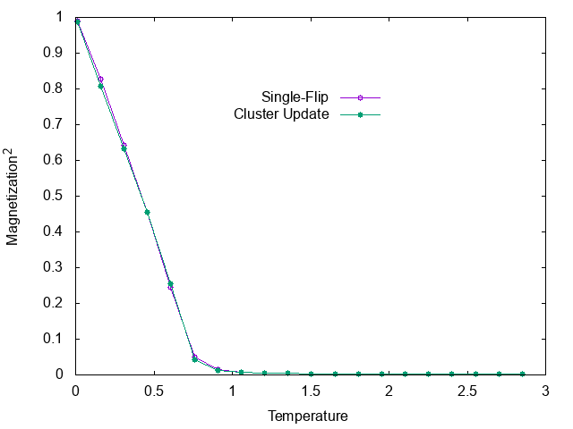

Monte Carlo simulation with cluster algorithm (Swendsen-Wang)
===

# Summary

Sample source code of Monte Carlo simulation with cluster updates.
Swendsen-Wang method is implemented for two-dimensional classical
Heisenberg model on a square lattice.

# Files

- main.cc

  A source file

- single.dat, cluster.dat

  Simulation results

- plot.plt

  Plot file for gnuplot

# Usage 

    $ make clean
    $ make graph

You will get the following graphs (gnuplot required).

* Magnetization

* Heat Capacity

The source code contains both single-flip and cluster algorithms.
`make` produces two executable files, single and cluster which are
single-flip and cluster updates, respectively.

`make run` gives you two results, single.dat and cluster.dat.
The results files contains temperature, square of
magnetization, and specific heat.

Note that, the default values of thermalization loops (T_LOOP)
and number of average (O_LOOP) are insufficient.
Additionally, adopting the same MC steps for the both single-flip
and cluster algorithms do not make sense, since correlation
times are much different between two methods.
