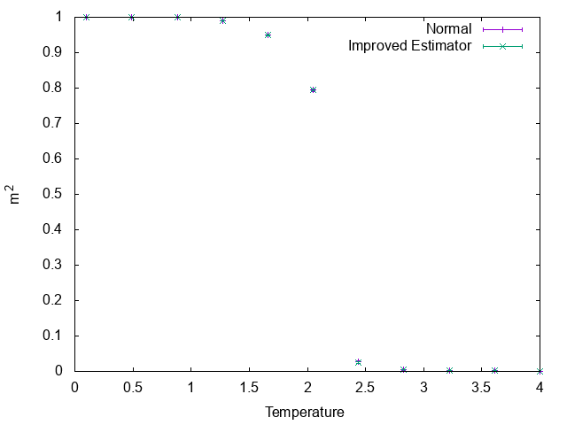

# Improved Estimator of Swendsen-Wang Algorithm for the Ising Model

A sample code of improved estimator of Swendsen-Wang algorithm for the Ising model.

## Usage

```sh
make
make graph
```

## Results

The 2nd-order of magnetization.



The 4th-order of magnetization.


The Binder ratio U =m^4/(m^2)^2.


## Acknowledgement

Special thanks to Y. Motoyama (ISSP).