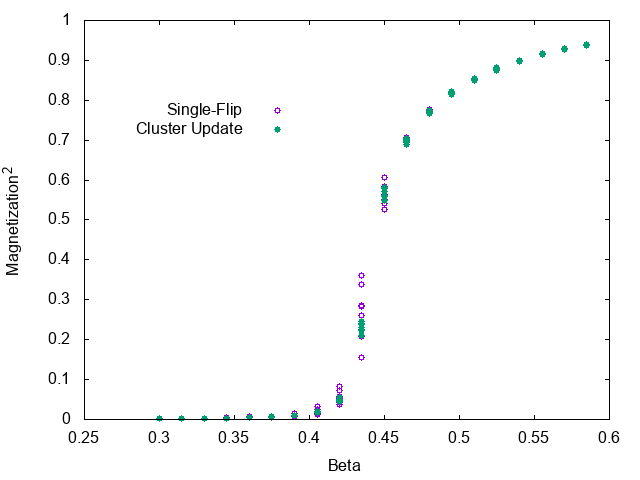

# Monte Calro simulation with cluster algorithm (Swendsen-Wang)

## Summary

Sample source code of Monte Calro simulation with cluster updates.
Swendsen-Wang method is implemented for two-dimensional Ising model
on a square lattice.

## Files

- main.cpp

   source file

- single.dat, cluster.dat

  Simulation results

- plot.plt

  Plot file for gnuplot

- plot.png

  Plot image by gnuplot

## Usage

    $ make graph

The above command will give you the following graph.

## Details

The source code contains both single-flip and cluster algorithms.
`make` produces two executables, single and cluster which are
single-flip and cluster updates, respectively.

`make run` gives you two results, single.dat and cluster.dat.
The results files contains beta (inverse temperature), square of
magnetization, and specific heat.

Note that, the default values of thermalization loops (`T_LOOP`)
and number of average (`S_LOOP`) are insufficient. You should increase the values to obtain results with sufficient accuracy.

This code is just a sample. I focus on simplicity instead of efficiency. There is room to optimize.
