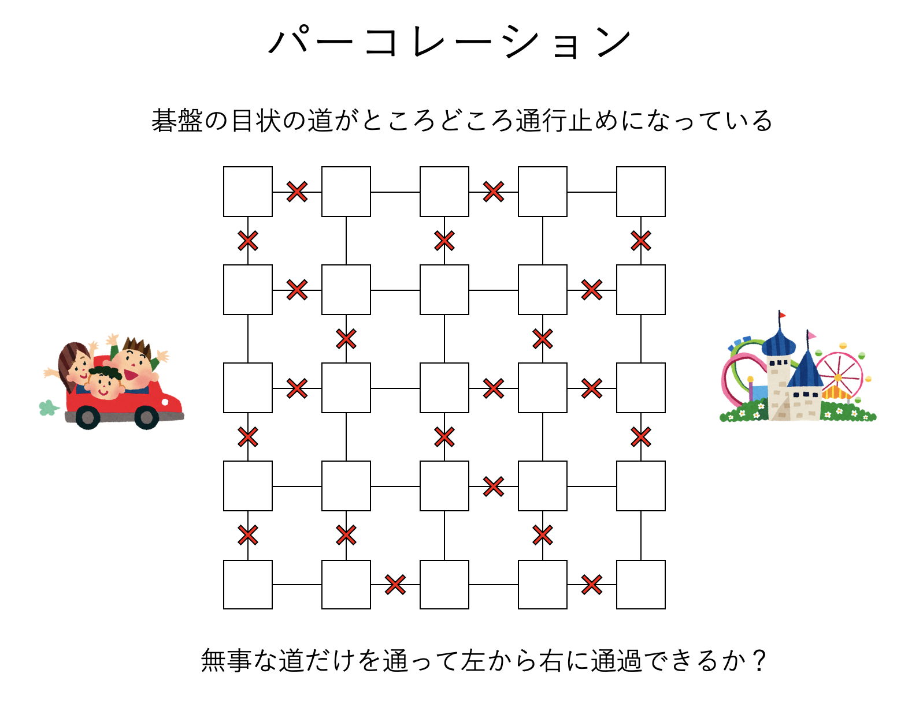

# パーコレーションのモンテカルロシミュレーションコード

# はじめに

二次元ボンドパーコレーションおよびサイトパーコレーションのモンテカルロ法コードのサンプルを書きました。

コードは以下に置いておきます。

[https://github.com/kaityo256/mc/tree/master/percolation/](https://github.com/kaityo256/mc/tree/master/percolation/)

# パーコレーションとは

いま、碁盤の目状の道を考えます。積雪などで、その道が確率的に通行不能になっているとします。いま、それぞれの道が確率$p$で独立に通行可能である時、通行可能な道のみを通って道の左端から右端まで横断できる確率$Cr$は$p$の関数になります。この関数形はどんな形になるでしょうか？



実は、ある確率のスレッショルド$p_c$があり、確率$p$が$p_c$より小さい時にはほぼ横断確率がゼロ、逆に$p_c$より大きい時にはほぼ横断確率が1になります。つまり、その確率$p_c$の前後で大きく系の性質が変わります。このように、パラメータを変化させた時に、ある点において大きく系の性質が変化することを相転移、またそのパラメータの値を臨界点(Critical Point)と呼びます。水の沸騰などが身近な相転移の例です。

先ほどの例では、$p<p_c$の時には道が全然つながっていない非浸透相から、$p>p_c$の時には全体がつながってる浸透相に変化します。このような系をパーコレーション(Percolation)と呼びます。パーコレーションは相転移をする最も簡単なモデルの一つです。相が変わるスレッショルドとなる確率$p_c$を臨界確率(Critical Probability)と呼びます。

このパーコレーションの相転移をプログラムで見てみましょう。

# プログラム

## ボンドパーコレーション

先ほど、確率$p$で道が通行可能、$1-p$で通行不可という問題を考えました。これをプログラムで組んでみましょう。プログラムは簡単で、全ての格子点に通し番号をつけます。この格子点をサイトと呼びましょう。上下、左右のサイトを確率$p$でつなぎます。サイト間に確率$p$でactive、$1-p$でinactiveなボンドがあるように見えるのでボンドパーコレーションと呼ばれます。

つなぐ処理は、Union-Findアルゴリズムを使えば簡単です。最初に、各サイトは「自分自身」だけが所属するクラスターに所属しており、つなぐ度に相手のクラスターに所属を変えて行くことにします。自分の所属するクラスターの「代表」のサイト番号をクラスター番号と呼ぶことにしましょう。

処理としては

1. 各サイトの所属するクラスター番号を初期化しておく
2. 上下、左右に確率$p$でサイトをつなぐ(クラスタリング)
3. 秩序変数を計算する

という処理を繰り返すだけです。

### 変数のセットアップ

ではプログラムを書いていきましょう。まずは必要なものをインクルードします。

```c++
#include <algorithm>
#include <iostream>
#include <random>
#include <vector>
```

次に、システムサイズやサイト数、Union-Findで使う配列`parent`も定義しておきましょう。

```c++
int L; // System Size
int N; // Number of Sites

std::vector<int> parent;
```

ボンドパーコレーションの場合は、ボンドの情報を保持する必要はありません。

### 初期化

今回はあまり必要ありませんが、一応初期化コードも書いておきましょう。

```c++
void init(int size) {
  L = size;
  N = L * L;
  parent.resize(N);
}
```

今回はサイズをハードコーディングするので不要ですが、プログラムでサイズを入力として受け取る場合には必要になります。

### Union-Find

サイトつなぐ(クラスタリングする)ためにUnion-Findアルゴリズムを使います。

```c++
int find(int i) {
  while (i != parent[i]) {
    i = parent[i];
  }
  return i;
}

void unite(int i, int j) {
  i = find(i);
  j = find(j);
  parent[j] = i;
}
```

このあたりはUnion-Findアルゴリズムの定番というか、半ばイディオムなのですぐに書けることでしょう。

### 接続

二つのサイト$i$と$j$を確率$p$でつなぐ関数`connect`を定義します。確率$p$で`unite(i,j)`を呼ぶだけです。

```c++
void connect(int i, int j, double p, std::mt19937 &mt) {
  std::uniform_real_distribution<> ud(0.0, 1.0);
  if (ud(mt) > p) return;
  unite(i, j);
}
```

### クラスタリング

全てのサイトについて、右と下のサイトと接続チェックをします。今回は自由境界としていますが、場所からサイト番号を取得する関数`pos2index`は周期境界も扱えるようにしてあります。

```c++
int pos2index(int ix, int iy) {
  ix = (ix + L) % L;
  iy = (iy + L) % L;
  return ix + iy * L;
}

void one_step(double p, std::mt19937 &mt) {
  for (int i = 0; i < N; i++) {
    parent[i] = i;
  }
  for (int iy = 0; iy < L - 1; iy++) {
    for (int ix = 0; ix < L - 1; ix++) {
      int i = pos2index(ix, iy);
      connect(i, pos2index(ix + 1, iy), p, mt);
      connect(i, pos2index(ix, iy + 1), p, mt);
    }
  }
}
```

### 横断確率

系の上端から下端に、通行可能な道だけを使って横断可能である確率$Cr$を計算します。そのために、横断可能なら$1.0$、そうでなければ$0.0$を返す関数`crossing_probability`を定義します。

全てのサイトのクラスター番号がわかっているので、系の上端と下端に同じクラスター番号に所属するサイトがあるかどうか調べるだけです。

```c++
double crossing_probability(void) {
  for (int ix1 = 0; ix1 < L; ix1++) {
    int i = find(pos2index(ix1, 0));
    int ci = find(i);
    for (int ix2 = 0; ix2 < L; ix2++) {
      int j = find(pos2index(ix2, L - 1));
      int cj = find(j);
      if (ci == cj)
        return 1.0;
    }
  }
  return 0.0;
}
```

### パーコレーション確率

確率$p$が臨界確率より大きい場合、系全体に広がる巨大なクラスターが出現します。このクラスターをパーコレーションクラスターと呼びます。系のサイトがパーコレーションクラスターに所属している確率をパーコレーション確率と呼びます。

ここでは簡単のため、「系の最大のクラスターが、全体に占める割合」をパーコレーション確率としましょう。

プログラムを組むのは簡単で、全てのクラスター番号のサイズを0に初期化しておき、サイトのクラスター番号を調べては、対応するサイズをインクリメントし、最後に最大値を$N$で割った値を返すだけです。

```c++
double percolation_probability(void) {
  std::vector<int> size(N, 0);
  for (int i = 0; i < N; i++) {
    int ci = find(i);
    size[ci]++;
  }
  int max = *std::max_element(size.begin(), size.end());
  return static_cast<double>(max) / N;
}
```

### モンテカルロ計算

ある確率$p$における横断確率$Cr(p)$と、パーコレーション確率$P(p)$をモンテカルロシミュレーションで推定するには、適当な回数だけループを回して平均値を計算すれば良いだけです。こんな感じになるでしょうか。

```c++
void mc(double p) {
  const int observe_loop = 1000;
  std::mt19937 mt;
  double cp = 0;
  double pp = 0.0;
  for (int i = 0; i < observe_loop; i++) {
    one_step(p, mt);
    cp += crossing_probability();
    pp += percolation_probability();
  }
  cp /= static_cast<double>(observe_loop);
  pp /= static_cast<double>(observe_loop);
  std::cout << p << " " << cp << " " << pp << std::endl;
}
```

特に難しいことはないと思います。

### 確率$p$依存性

あとは確率$p$をふって、それぞれの$p$で`mc(p)`を呼ぶだけです。とりあえず$p=0$から$p=1$まで50分割してシミュレーションするならこんな感じでしょうか。

```c++
int main(void) {
  int ND = 50;
  int size = 32;
  init(size);
  for (int i = 0; i <= ND; i++) {
    double p = static_cast<double>(i) / ND;
    mc(p);
  }
}
```

ここではサイズ等をハードコーディングしていますが、実行時引数としてサイズとか受け取りたい人は適当に修正してください。

## サイトパーコレーション

先ほどは「道」が確率$p$で通行可能(active)かどうかを調べるボンドパーコレーションを考えましたが、今度は「サイト」が確率$p$でactiveになるようなモデルを考えましょう。正方格子の格子点が、確率$p$でactive、$1-p$でinactiveになるとします。この時、上下左右にactiveなサイトがつながっていたら、それらは同じクラスターに所属するとします。そして、activeなサイトだけを伝って、系を横断可能かどうかを調べましょう。これをサイトパーコレーション(Site-Percolation)と呼びます。

ほとんどボンドパーコレーションとプログラムが同じですが、今度はサイトがactiveかどうかを保持するための変数`sites`が必要になります。

```c++
#include <algorithm>
#include <iostream>
#include <random>
#include <vector>

int L; // System Size
int N; // Number of Sites

std::vector<int> sites;
std::vector<int> parent;
```

サイトがactiveかどうかを保持するので、`std::vector<bool>`を使いたくなりますが、`vector<bool>`はビット情報をパックしている可能性がある(処理系依存)なので使わないことにします(どうしてこんな仕様にしたんだか……)。

### 接続

サイトパーコレーションでは、隣接するサイト$i$と$j$が両方activeなら接続します。素直に実装するとこんな感じでしょうか。

```c++
void connect(int i, int j) {
  if (sites[i] == 0)
    return;
  if (sites[j] == 0)
    return;
  unite(i, j);
}
```

### モンテカルロ計算

ボンドパーコレーションと異なり、最初に各サイトにactive/inactiveを設定する処理が追加されます。っていうか違いはそれだけです。

```c++
void one_step(double p, std::mt19937 &mt) {
  std::uniform_real_distribution<> ud(0.0, 1.0);
  for (int i = 0; i < N; i++) {
    parent[i] = i;
    if (ud(mt) < p) {
      sites[i] = 1;
    } else {
      sites[i] = 0;
    }
  }
  for (int iy = 0; iy < L - 1; iy++) {
    for (int ix = 0; ix < L - 1; ix++) {
      int i = pos2index(ix, iy);
      connect(i, pos2index(ix + 1, iy));
      connect(i, pos2index(ix, iy + 1));
    }
  }
}
```

あとはボンドパーコレーションと同じです。

# 結果

$L=32$の時の結果はこんな感じになります。

まずは横断確率(Crossing Probability)。


ある臨界点$p_c$を境に、急激に横断確率が0から1に変化していることがわかります。ボンドパーコレーションの時には厳密に$p_c=1/2$、サイトパーコレーションの時には$p_c \sim 0.593$です。だいたいそのくらいになっていることがわかります。

次はパーコレーション確率(Percolation Probability)です。


これも臨界点近傍で急激に立ち上がる関数になります。

# まとめ

相転移を起こす簡単なモデル、パーコレーションを実装してみました。パーコレーションはプログラムが簡単ですが、いざサンプルコードを探そうとするといまいち見つからないので、ここにまとめておきます。

速度面は全く考慮していないので、高速化の余地はかなりあります。

このコードが誰かの参考になれば幸いです。

